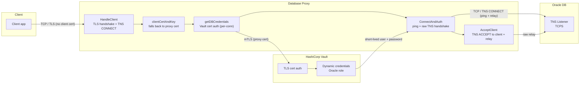
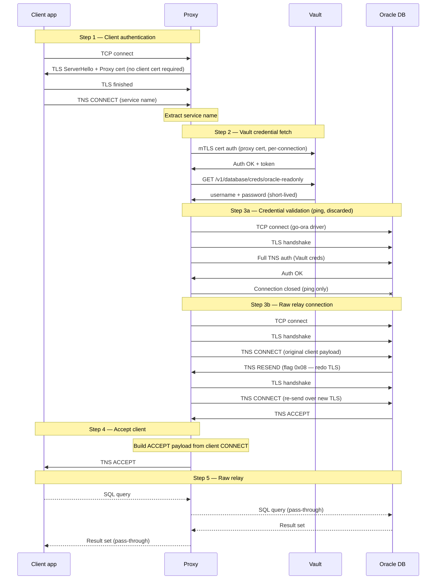

# Oracle Proxy — PoC Overview

## What it does

A TCP proxy that sits between Oracle clients and an Oracle database. It authenticates to Vault using the proxy's own TLS certificate and injects short-lived Vault-issued credentials for the actual database connection — clients never see or supply database passwords.

**Connection flow:**

1. Client connects over TLS — no client certificate is required; the proxy presents its own cert and the TLS session is established
2. Proxy creates a per-connection Vault client authenticated with the proxy's own TLS certificate (Oracle clients present no cert, so CN-based lookup always falls back) and fetches a short-lived Oracle username/password
3. Proxy validates credentials via go-ora `db.Ping()` (discarded), then opens a raw TCP connection to Oracle and completes the Oracle-specific TNS CONNECT/RESEND/TLS-renegotiation/ACCEPT handshake
4. Proxy constructs a TNS ACCEPT from the client's CONNECT packet and sends it; raw bidirectional relay begins

After the handshake, the proxy is transparent — it does not inspect or modify SQL traffic.

---

## What is achieved

- **Zero-password clients** — applications connect without supplying any database password; no credentials are configured on the client side
- **Short-lived credentials** — Vault creates a new Oracle user per connection (default TTL 1h), automatically revoked on expiry
- **TCPS support** — the proxy→Oracle leg performs the Oracle-specific TLS renegotiation (TNS RESEND with flag `0x08`) that Oracle requires before accepting a CONNECT over SSL
- **Identity logging** — the proxy's certificate CN is used for Vault auth; per-connection Vault clients scope each lease independently

---

## Known issues and trade-offs

**Two DB connections per client**
Each client causes two TCP connections to Oracle: one via `go-ora` `db.Ping()` to validate Vault credentials, and a second raw TCP connection for the actual relay. The driver does not expose its underlying socket, so auth and relay cannot share one connection. A production implementation would authenticate directly on the raw socket and skip the `Ping()`.

**SSL VERIFY disabled on the Ping connection**
`go-ora` cannot be passed a custom CA cert at runtime, so `SSL VERIFY=FALSE` is used for the credential-check connection. The relay connection uses full TLS verification via a custom CA. This means the credential check is susceptible to MITM for that one short-lived call.

**Oracle ACCEPT payload is not mirrored from Oracle**
The TNS ACCEPT sent to the client is constructed from the client's own CONNECT packet rather than forwarded from Oracle's ACCEPT. Oracle's negotiated SDU/TDU values are not propagated — this works in practice but is not spec-compliant.

**No client identity**
Oracle clients present no TLS client certificate to the proxy (`tls.NoClientCert`). There is no client CN to log or forward to Oracle. Oracle audit logs show only the Vault-issued username.

**Plain-TCP Oracle not supported**
`HandleClient` requires TCPS — the proxy immediately performs a TLS handshake on accept. Plain-TCP Oracle listeners are not supported without code changes.

**No connection pooling**
One Vault lease and one Oracle session are created per client connection. Under high connection rates this will exhaust Vault's lease limit and Oracle's session limit quickly.

**PoC scope — not production-ready**
No connection timeouts, no metrics, no graceful shutdown, no lease renewal, and no handling of Oracle `REDIRECT` packets (used by RAC and some load balancers).
